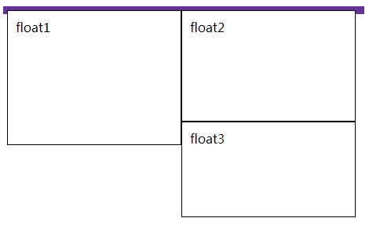

##  浮动的产生

```html
<div class="outer">
    <div class="float float1">float1</div>
    <div class="float float2">float2</div>
    <div class="float float3">float3</div>
    <div class="clear"></div>
</div>
```

样式

```css
.outer {
    background-color: rgb(224, 206, 247);
    border: 5px solid rebeccapurple;
    width: 450px
}

.float {
    float: left;
    width: 200px;
    height: 150px;
    background-color: white;
    border:1px solid black;
    padding: 10px;
}
.float2 {
    height: 120px;
}
.float3 {
    height: 100px;
}
```

效果




## 解决浮动

### 添加一个清除浮动的元素

```html
<div class="outer">
    <div class="float float1">float1</div>
    <div class="float float2">float2</div>
    <div class="float float3">float3</div>
    <div class="clear"></div>
</div>
```

样式

```css
.clear {
    height: 0;
    width: 0;
    clear: both;
}
```


### 利用伪元素清除浮动

```css
.outer:after {
    display: block;
    content: ' ';
    height: 0;
    font-size: 0;
    clear: both;
}
```


### 利用 BFC 清除浮动

```css
.outer {
    float: left;
    // display: inline-block;
}
```

