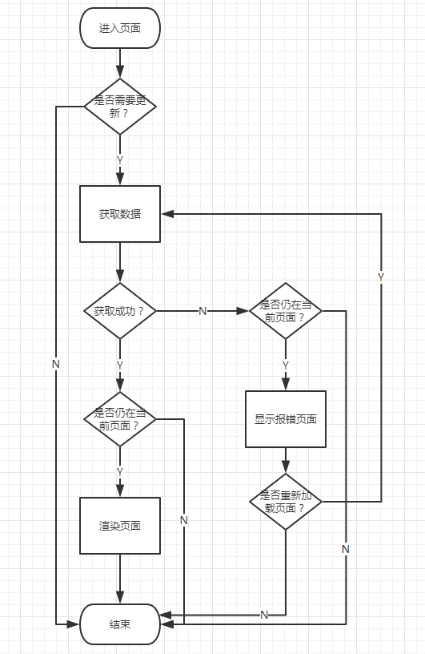

#### 页面基本原则

1. 一个页面应该有且仅有一个 `update` 函数。
2. 每次进入页面都会调用 `update` 函数获取数据，重新渲染页面。
3. 如果是首次进入页面，显示加载动画，否则静默调用，避免给用户页面重载的等待。
4. 一个页面如果有多个异步数据请求，应当通过并发的方式由 `update` 发起。
5. 并发请求中如果有请求出现错误，应当立即抛出并交由统一的 **页面错误机制** 处理。
6. **页面错误机制** 应当提供页面重新加载的**按钮**供用户在页面出错时重新加载。
7. 根据参数不同而页面数据不同的页面应当每次进入时都显示加载按钮。（例如用户页，详情页）
8. 页面有可能出现空数据的地方应该提供相应的缺省图。
9. 在用户离开页面时尽可能回收没必要持久化的数据以及停止定时器。（不影响体验下）

#### 统一错误处理机制

1. 当页面 `update` 函数抛出错误时，交由 `错误处理机制` 进行处理。
2. `错误处理机制` 弹出错误显示界面，显示具体的报错请求，并交由用户选择是否重新发起页面请求或者取消。（应当由重新加载按钮和取消按钮）
3. `错误处理机制` 中的重新加载方法是 `update` 函数交由 `错误处理机制` 的回调。

#### 页面更新流程

